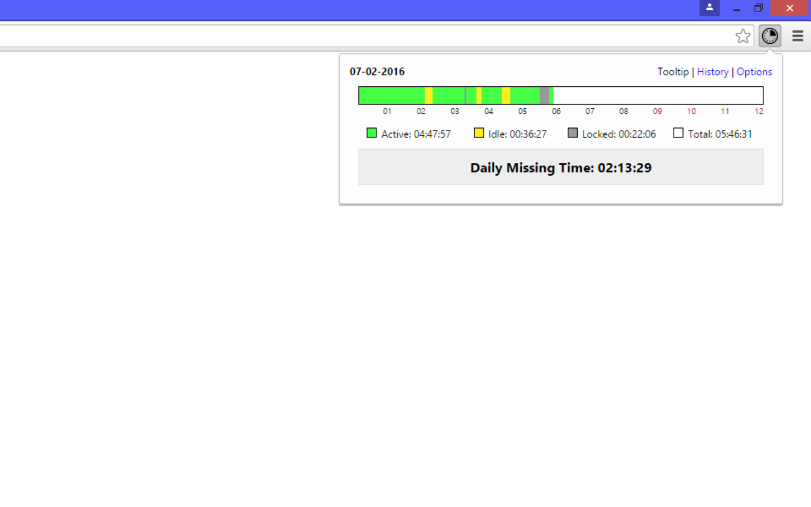
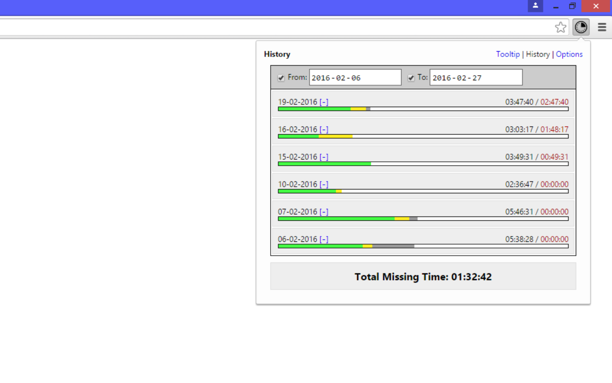
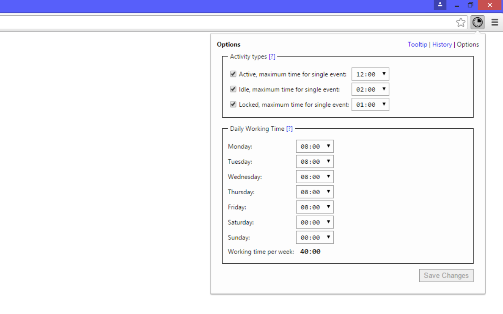

# time-logger

Chrome extension to control time spent in the office, calculate overtime and to plan working time.

Time Logger register time spent in the office based on Chrome events:
- active - time actively spent at a computer,
- idle - time spent at a computer without action,
- locked - time when coputer is logged out.

**Link to extentions:**
[Chrome Web Store](https://chrome.google.com/webstore/detail/time-logger/dkobldfabdbefflhaahchfegnnfgcikg)

**Screenshots:**

Tooltip:

History:

Options:

